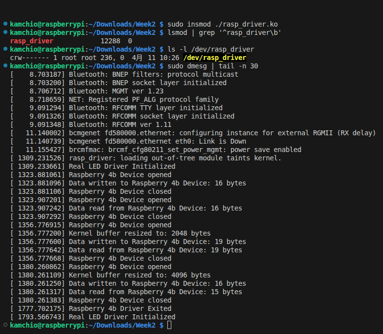
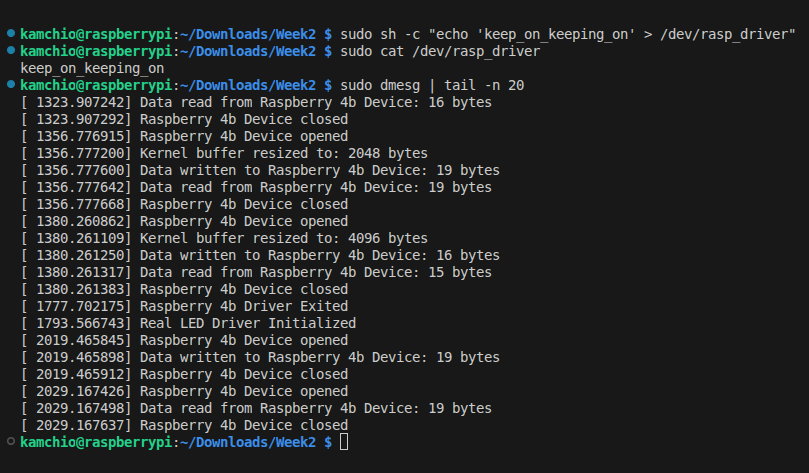
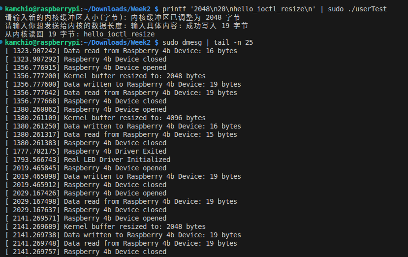
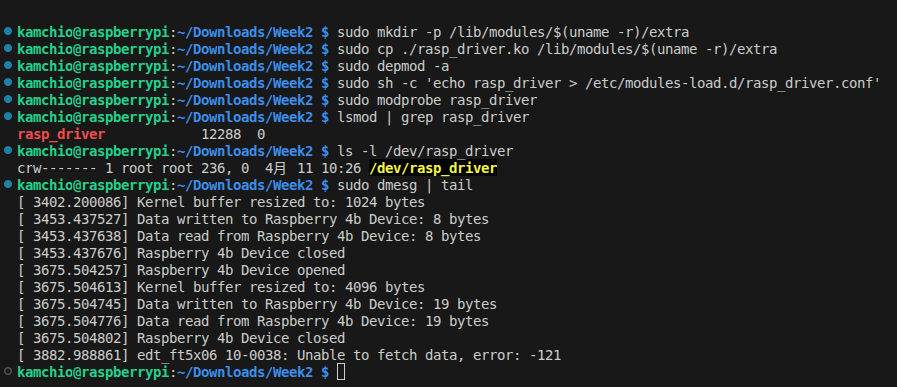

# rasp_driver 驱动测试报告

测试目录：`/home/kamchio/Downloads/Week2`
测试时间：2026-04-11
测试环境：Raspberry Pi Linux `6.12.47+rpt-rpi-v8`

## 1. insmod 加载、dmesg 日志与 /dev 设备节点检查

### 关键结果
- `lsmod` 显示模块已加载：`rasp_driver 12288 0`
- `/dev/rasp_driver` 已创建：`crw------- 1 root root ... /dev/rasp_driver`
- `dmesg` 出现驱动初始化日志：
  - `rasp_driver: loading out-of-tree module taints kernel.`
  - `Real LED Driver Initialized`

### 结论
- 通过：驱动可成功 `insmod`，并在 `dmesg` 看到日志，`/dev` 下存在设备节点。

---

## 2. 既定功能验证：通过 cat/echo 读写设备文件

### 关键结果
- `cat` 输出：`keep_on_keeping_on`
- `dmesg` 显示驱动读写回调被调用：
  - `Raspberry 4b Device opened`
  - `Data written to Raspberry 4b Device: 16 bytes`
  - `Data read from Raspberry 4b Device: 16 bytes`
  - `Raspberry 4b Device closed`

### 结论
- 通过：可使用 `echo` 写入、`cat` 读取设备文件，驱动缓冲区读写逻辑正常。

### 说明（固定大小缓冲区）
- 驱动初始化时分配默认缓冲区 `DEFAULT_BUF_SIZE = 1024`。
- 在未调用 `ioctl` 调整前，缓冲区按固定大小工作。

---

## 3. userTest 执行与 ioctl 动态调整缓冲区验证

### 3.1 userTest

#### 结论
- 通过：`userTest` 可正常调用 `ioctl(SET_BUF_SIZE)` 动态调整设备缓冲区大小，并完成读写验证。

### 3.2 userTest_test（补充验证）

#### 关键结果
- 用户态显示：`内核缓冲区已调整为 4096 字节`
- `dmesg` 显示：`Kernel buffer resized to: 4096 bytes`

#### 结论
- 通过：第二个测试程序同样验证了 `ioctl` 动态扩容路径。

---

## 4.开机自启设置

## 备注

- 当前设备节点权限为 `crw------- root root`，普通用户直接访问会受限，测试时使用了 `sudo`。
