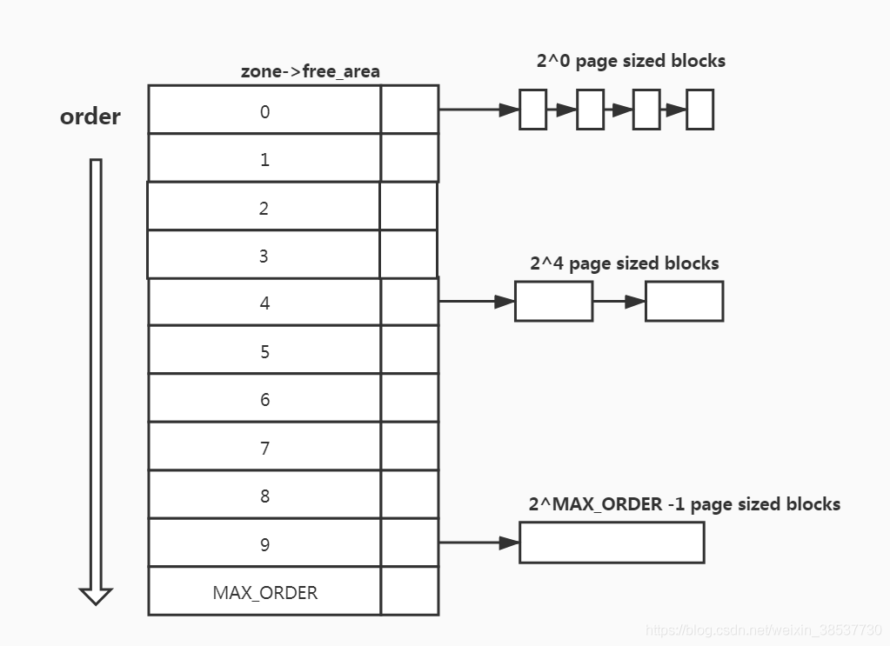

# Week 3 Tasks

## 1.临界区的概念及其必要性

Linux临界区（Critical Section）指在多进程场景下访问共享资源（如全局变量、设备）的代码片段 - 多进程并发运行多个程序并对共享资源访问便会引发竞态问题，解决静态的其中一个方法就是互斥，即在一条内核执行路径上访问共享资源时，不允许其他内核执行路径来访问共享资源（临界资源），而访问共享资源的这段代码就叫做临界代码段或临界区(critical section)。对于不论内核态还是用户态来说常见的保护临界区机制有：互斥锁(Mutex),信号量(semaphore),自旋锁(spinlock), 原子操作(Atomic operations)。
临界区的必要性在于在并发编程中保护共享资源（如变量、文件、硬件）的一致性和完整性。通过确保同一时间仅允许一个线程/进程执行访问共享代码的“临界区”，其防止了竞态条件（Race Condition）导致的数据破坏，是实现多线程/进程正确同步、互斥访问的必要机制

## 2.内核抢占模型对并发的影响(Non-Preemptive vs PREEMPT_RT)

内核抢占模型决定了“一个任务能否在内核态被更高优先级任务打断”，这直接影响并发实时性、响应延迟和系统吞吐。其中此两种抢占模型于Linux源码的/kernel/Kconfig.preempt中有所提及-

非抢占内核（PREEMPT_NONE，No Forced Preemption）：这是最传统的 Linux 模型，其核心逻辑是如果一个进程进入了内核态（例如通过系统调用请求磁盘读写），除非它主动让出 CPU（显式调用 schedule()）或者任务已经完成，否则它不会被其他进程打断。此模型可以保证CPU原始算力最大化及大数据吞吐量，但如果某个内核任务运行时间很长，即便此时用户点了一下鼠标（高优先级任务），系统也必须等内核任务忙完。这就会导致偶尔的“卡顿”

实时内核（PREEMPT_RT，Fully Preemptible Kernel）：此抢占模型逻辑在于只要进程不在执行关键的“原子操作”（比如拿着自旋锁时），即使它还在内核态忙碌，只要有一个更高优先级的任务（如 UI 操作）到来了，内核会立即强行中断当前进程，把 CPU 交给高优先级任务。此模型虽然保证了系统对用户快速反映及实时性，但同时增加了调度器的负担，会有一定的运行开销（Overhead），其频繁调度导致其处理同一任务的总时长可能比PREEMPT_NONE还久


## 3.Linux内核提供了哪些同步机制？ 死锁的成因及如何避免

Linux 内核常见同步机制可按“是否睡眠”分为两类：

1. 不可睡眠（原子上下文可用）
- 自旋锁（spinlock）: 忙等，适合临界区短、不能睡眠的场景（如中断上下文）。
- 读写自旋锁（rwlock）: 读多写少场景提升并发读能力。
- 原子变量（atomic_t/atomic64_t）: 单变量原子加减、比较交换等。
- 位操作与内存屏障（barrier）: 保证可见性和有序性，常用于 lock-free 场景。
- RCU（Read-Copy-Update）: 读路径几乎无锁，写侧通过复制+延迟回收完成更新。

2. 可睡眠（进程上下文）
- 互斥锁（mutex）: 持锁线程可睡眠，适合较长临界区。
- 读写信号量（rw_semaphore）: 支持多读单写。
- 信号量（semaphore）: 计数型资源访问控制。
- 完成量（completion）: 一次性事件同步（一个/多个等待者等待事件完成）。
- 等待队列（wait queue）: 条件不满足时休眠，条件满足后唤醒。

Linux死锁是两个或多个进程/线程在竞争资源时相互等待，导致均无法推进的阻塞状态，其有如下成因：
- 互斥（Mutual exclusion）: 资源一次只能被一个执行流占有（资源不能被共享，只能由一个进程使用。
）。
- 占有且等待（Hold and wait）: 进程已获得了一些资源，但因请求其它资源被阻塞时，对已获得的资源保持不放。
- 不可剥夺（No pre-emption）: 有些系统资源是不可抢占的，当某个进程已获得这种资源后，系统不能强行收回，只能由进程使用完时自己释放。
- 循环等待（Circular wait）: 若干个进程形成环形链，每个都占用对方申请的下一个资源。

如何避免死锁：
避免死锁的核心在于破坏死锁产生的四个必要条件（互斥、占有且等待、不可抢占、循环等待）。最常用且有效的方法是破坏循环等待条件，即采用资源有序分配法，对资源进行排序后按序申请；其次可以通过一次性分配所有资源（破坏“占有且等待”）或锁超时释放机制（破坏“不可抢占”）来预防。 

具体避免死锁的策略如下：
1. 破坏“循环等待”条件（资源有序分配）
这是最常用且高效率的方法。将系统中的资源进行编号，规定所有进程必须按照编号递增（或递减）的顺序申请资源，从而打破资源的环路依赖。 

示例： 如果线程 A 需要锁 1 和锁 2，线程 B 也需要锁 1 和锁 2，则强制规定都必须先申请锁 1 再申请锁 2。

2. 破坏“占有且等待”条件（静态分配）
要求进程在开始执行前一次性申请所有需要的资源。如果在运行期间只要有一个资源未能满足，则该进程不占有任何资源，直接进入等待状态，直到资源全部满足。 


3. 破坏“不可抢占”条件（剥夺资源）
如果一个已占有资源的进程在申请新资源时被拒绝，它必须主动释放之前持有的所有资源，之后再重新申请

## 4.内存管理三大数据结构

Linux 内存管理核心常说的三大结构是：

1. 页（page）
- 对应结构体 `struct page`，表示物理内存页框的元数据。
- 记录引用计数、标志位、映射关系、所属 zone/node 等。
- 伙伴系统和 slab 最终都以 page 为底层资源单位。

2. 区域（zone）
- 对应 `struct zone`，把内存按硬件/用途分区管理。
- 常见 zone: `ZONE_DMA`、`ZONE_DMA32`、`ZONE_NORMAL`、`ZONE_MOVABLE`。
- 每个 zone 维护水位线、空闲页链表、回收统计等。

3. 节点（node）
- 对应 `struct pglist_data`（常称 pgdat），代表一个 NUMA 节点。
- 一个 node 包含多个 zone，并维护该节点的内存管理状态。
- UMA 可视为单 node，NUMA 下不同 node 访问延迟不同。
 

## 5.伙伴系统

伙伴系统（Buddy Allocator）是内核页分配器，用于管理物理页的“分配与合并”。其会把连续物理页按 $2^k$ 大小的页分成不同 order 的空闲块。其中内核维护了一个 free_area 数组，每一级 Order 对应一个链表，记录了当前所有空闲的、该尺寸的内存块（详见``` include/linux/mmzone.h```中 ```struct zone```和```free_area```结构体 ）。

使用步骤：
- 申请时，找到满足需求的最小 order；若该order中没有可用的块，就从更大order的块不断对半拆分。
- 拆分之后两个子块互为Buddies, 其中一个块被用于分配，另一个根据其大小被放入对应order的linked list 下
- 释放时，检查其“伙伴块”是否同为空闲且同阶，若是则合并，递归向上。

优点：
- 分配/释放速度快，适合页级别内存管理。
- 可通过合并减少外部碎片。

局限：
- 对小对象分配不高效，容易产生内部碎片。
- 高阶连续页在长期运行后较难满足（内存碎片化）。

因此内核通常是：
- 页级别内存分配由 buddy 管理。
- 小对象内存分配交给 slab/slub 在页上再做细分分配。

## 6.什么是slab? cache color是什么

slab 是内核对象分配器思想（Linux 常见实现为 SLAB/SLUB/SLOB 之一），用于高效分配“小而频繁”的内核对象。在内核中，我们经常需要分配成千上万个小结构体（比如 struct task_struct 或 struct file）。如果这些小对象都去向伙伴系统申请（最小 4KB），会造成巨大的空间浪费（内部碎片）。SLAB 的出现就是为了解决这个问题。

slab 的基本机制：
首先为特定类型的对象创建 **cache**（高速缓存），每个 cache 由多个 **slab** 组成，而一个 slab 本质上是伙伴系统分配的一组物理页。内核将这些页拆分为固定大小的 **object**（对象）单元。当进程需要获取一个对象时，直接从对应的 cache 中取出一个空闲的 object；使用完毕后将其释放回 cache 中以供复用。

slab 优势：
- 降低分配延迟，提升缓存局部性。
- 减少小对象分配导致的碎片。
- 支持构造/析构、调试填充、红区检查等。

**cache color（缓存着色）**：
如果多个 Slab 块的起始物理地址在 Cache 映射逻辑中正好对应同一个 Cache Set，那么当你交替访问这些 Slab 中的第一个对象时，CPU 就会不停地把前一个对象的缓存擦除，再载入后一个,这种现象叫 **Cache Thrashing（缓存抖动）**。为了打破这种“地址对齐”导致的冲突以优化CPU缓存利用率，SLAB 在分配每个 Slab 块时，故意在开头留出一点点空隙（Padding），这就是所谓的“着色（coloring）”。具体比如：一个 Slab 块是由伙伴系统给的物理页组成的（比如 4KB）。如果每个对象 128 字节，刚好能放 32 个。但如果对象大小和对齐要求使得最后剩下几十个字节没用上，这些就是“着色空间”。

## 7.上层程序调用malloc()申请了一块内存，从上层到kernel层发生了什么

用户态 `malloc()` 到内核层大致流程如下：

1. 用户态分配器处理（glibc ptmalloc 等）
- `malloc()` 先在用户态堆管理器里找可用空闲块（bins/tcache）。
- 若找到空闲块，直接返回，不进入内核。

2. 用户态空间不足时向内核要内存
- 小块扩展常走 `brk/sbrk`，扩大进程 heap 末端。
- 大块分配常走 `mmap`，映射一段新的虚拟内存区域（VMA）。

3. 内核建立虚拟内存映射
- 内核会在```task_struct -> mm_struct```里找一段合适的虚拟地址范围,然后更新该进程的虚拟内存描述```vm_area_struct```（VMA）以标示此段地址属于特定进程，通常此时只“保留地址空间”，未立即分配全部物理页。

4. 首次访问触发缺页异常（按需分配）
- 程序真正读写该地址时触发 page fault。
- 内核检查发现，这个地址在之前的 VMA 登记过，是合法的，只是还没分配物理内存。而后分配物调用伙伴系统 (Buddy System)，从空闲物理内存中拨出一个 4KB 的页框。，建立页表映射，更新权限位。

5. 可能发生回收与换页
- 若内存紧张，内核可能触发回收（kswapd/direct reclaim）、页回写或 swap。

6. free 的行为
- `free()` 多数先回收到用户态分配器缓存，不一定立刻归还内核。
- 对某些 `mmap` 大块，可能通过 `munmap` 直接归还内核虚拟内存区域。


## 8.vmalloc VS kmalloc 

### 1. 分别使用kmalloc/vmalloc分配1MB内存，并在dmesg中反映分配的地址
```
  [931.349667] kvmalloc_driver: loading out-of-tree module taints kernel.                                                                       
  [931.351221] kvmalloc Driver Initialized                                                                                                      
  [931.352132] Kernel buffer allocated by kmalloc at address: 0xffffff8064700000                                                                
  [931.353112] Kernel buffer allocated by vmalloc at address: 0xffffffc082b95000 
```

### 2. 使用 /proc/kallsyms 或 System.map 估算内核直接映射区(low memory)的边界范围，观察两个地址是否在此区城

```
# kallsyms 关键符号
ffffffdd49000000 T _text            ← 内核镜像起始
ffffffdd4a7e0000 B _end             ← 内核镜像结束
ffffffdd4a232c90 D memstart_addr

# 物理内存（/proc/iomem）
00000000-3b3fffff : System RAM      (~948 MB)
40000000-7fffffff : System RAM      (~1024 MB)
# 物理内存上限约 0x80000000 (2 GB)

# VA 位宽
CONFIG_ARM64_VA_BITS_39=y
CONFIG_ARM64_VA_BITS=39

# 最低 kallsyms 地址（vmalloc 区）
ffffffc080195c88  ← vmalloc 区起始附近
```

#### 内核内存布局推导（ARM64 39-bit VA）

| 区域 | 虚拟地址范围 | 推导依据 |
|------|-------------|---------|
| **线性映射区（直接映射）** | `0xffffff8000000000` ~ `0xffffff8080000000` | `PAGE_OFFSET = 0xffffff8000000000`，物理内存上限 2GB |
| **vmalloc 区** | `0xffffffc000000000` 起 | kallsyms 最低地址为 `0xffffffc0...` |
| **内核镜像区** | `0xffffffdd49000000` 起 | `_text` 符号地址 |

### 地址验证

| 分配方式 | 地址 | 是否在直接映射区 | 备注 |
|----------|------|----------------|------|
| `kmalloc` | `0xffffff8064700000` | **是** | 对应物理地址 `0x64700000`（约 1607 MB），在物理 RAM 范围内 |
| `vmalloc` | `0xffffffc082b95000` | **否** | 位于 vmalloc 区（`0xffffffc0...`），物理地址不连续 |


- `kmalloc` 地址落在**内核线性映射区**，虚拟地址与物理地址有固定偏移（`PAGE_OFFSET`），可直接换算物理地址
- `vmalloc` 地址落在 **vmalloc 区**，通过页表动态映射，物理页不保证连续，无法直接换算

### 3.读写访问分配内存的第一个及最后一个字节
#### 用户态输出

```
write first=0x5a  last=0xa5
read  first=0x5a  last=0xa5
read bytes=1048576
verify: userspace readback matches written data
check dmesg for both kmalloc/vmalloc boundary bytes logged by the driver
```

#### 内核 dmesg 输出

```
[1529.542818] kvmalloc Device opened
[1529.576444] Data written to kvmalloc Device: 1048576 bytes
[1529.576478] After write: kmalloc[first=0x5a last=0xa5] vmalloc[first=0x5a last=0xa5]
[1529.576511] Before read: kmalloc[first=0x5a last=0xa5] vmalloc[first=0x5a last=0xa5]
[1529.577588] Data read from kvmalloc Device: 1048576 bytes
[1529.578716] kvmalloc Device closed
```

### 4.查看Buddy system 及 slab 缓存
### Buddy System 结果（`/proc/buddyinfo`）

```
Node 0, zone   DMA    6   5   5   6   5   5   5   6   4   3  208
Node 0, zone DMA32  124  17   5   4   8  19  16   9   7   9   81
```

各列对应 order 0 ~ order 10 的空闲块数，块大小 = `2^order × 4KB`：

| Order | 块大小 | DMA 空闲块 | DMA32 空闲块 |
|-------|--------|-----------|-------------|
| 0 | 4 KB | 6 | 124 |
| 1 | 8 KB | 5 | 17 |
| 2 | 16 KB | 5 | 5 |
| 3 | 32 KB | 6 | 4 |
| 4 | 64 KB | 5 | 8 |
| 5 | 128 KB | 5 | 19 |
| 6 | 256 KB | 5 | 16 |
| 7 | 512 KB | 6 | 9 |
| 8 | 1 MB | 4 | 7 |
| 9 | 2 MB | 3 | 9 |
| **10** | **4 MB** | **208** | **81** |

**观察**：order 10（4MB 大块）数量最多，说明系统空闲内存充裕、碎片化程度低，大量连续物理页可用。本次驱动 `kmalloc` 分配 1MB 连续内存时，buddy system 能够顺利提供。

---

### Slab 结果（`/proc/slabinfo`）

#### 通用 kmalloc 缓存

| 名称 | 活跃对象数 | 对象大小 |
|------|-----------|---------|
| `kmalloc-64` | 23448 | 64 B |
| `kmalloc-128` | 5567 | 128 B |
| `kmalloc-192` | 1932 | 192 B |
| `kmalloc-512` | 1792 | 512 B |
| `kmalloc-256` | 1232 | 256 B |
| `kmalloc-1k` | 870 | 1024 B |
| `kmalloc-2k` | 720 | 2048 B |
| `kmalloc-4k` | 340 | 4096 B |
| `kmalloc-8k` | 60 | 8192 B |

> `kmalloc-64` 活跃对象最多（23448），是内核小对象分配的主力缓存。

### 实验现象说明：
| 实验内容 | 关键结论 |
|----------|---------|
| 驱动加载 | `kmalloc` 分配物理连续内存（线性映射区），`vmalloc` 分配虚拟连续内存（vmalloc 区） |
| 地址分析 | ARM64 39-bit VA：线性映射区 `0xffffff8000000000~0xffffff8080000000`，vmalloc 区 `0xffffffc000000000` 起 |
| 读写验证 | 1MB 数据写入/读回完全正确，首尾字节与预期一致 |
| Buddy System | order 10（4MB）空闲块最多，内存碎片化低，大块连续内存可用 |
| Slab | `kmalloc-64` 使用最频繁；`vmap_area` slab 负责管理 vmalloc 映射 |
