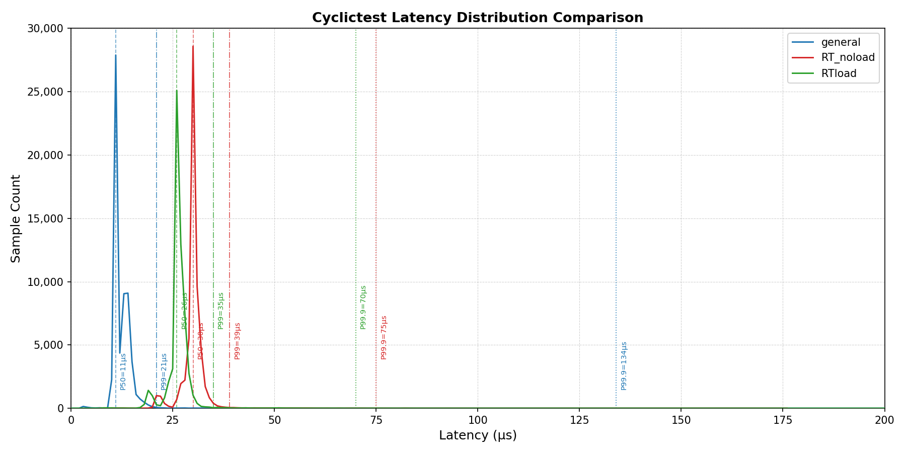

# RT Linux 探索
---

## 1.Linux实时性瓶颈
Linux 作为通用分时操作系统（GPOS），其目的在于提供给用户构建一个完整、稳定的开源操作系统。在设计Linux的进程调度算法时主要考虑的是公平性，调度器尽可能将可用的资源平均分配给所有需要处理器的进程，并保证每个进程都得以运行。但这个设计目标是和实时进程的需求背道而驰的，所以标准Linux并不提供强实时性。具体来说，Linux于实时性方面主要是受内核抢占机制、进程调度方式、中断处理机制、时钟粒度、共享资源错配等这几个方面的制约：

### 内核抢占机制
Linux的系统进程运行分为用户态和内核态两种模式，虽然运行在用户态的程序支持高优先级进程抢占进程，但在Linux早期版本中（2.6版前）如果一个进程通过系统调用进入内核态，其他进程即使优先级再高也无法抢占该进程，必须等到内核态操作完成或进程主动放弃 CPU。对于此痛点现代内核提供了PREEMPT_NONE，PREEMPT_VOLUNTARY，PREEMPT这三种抢占模式（尤其是PREEMPT）供用户根据不同需求灵活改动内核抢占模式

### 进程调度机制
Linux系统提供符合POSIX标准（IEEE Std 1003.1）的调度策略，包括FIFO调度策略(SCHED_FIFO)、带时间片轮转的实时调度策略(SCHED_RR)和静态优先级抢占式调度策略(SCHED_OTHER)。其中SCHED_OTHER为Linux默认调度策略，其目的为让众进程能够公平的使用CPU及其他资源但在实时性方面表现相当不尽人意。其另两种进程调度策略似乎支持用户根据进程优先级进行进程抢占从而达成实时调度的效果，然而内核中依旧可能存在大量如中断处理，自旋锁等不可抢占区域，即使用户开启了SCHED_FIFO也无法抢占一个正处理长耗时的中断

### 中断处理延迟
Linux 采用上半部（Hard IRQ）和下半部（Soft IRQ/Tasklets）的中断处理机制，Linux在进行中断处理时都会关闭本地中断；如果上半部中断处理函数执行时间过长，期间即使有更高优先级的实时进程发生中断，系统也无法响应直到前一个中断处理完毕。这样会大大加大系统中断及调度延时

### 时钟粒度
在Linux未经特殊配置的默认内核中系统依赖一个周期性硬件中断（System Tick），其时钟频率由内核参数CONFIG_HZ决定（通常为50-1200Hz），其不够实时场景下微秒（us）级响应的需求，更不用说由于内核关中断、锁竞争导致实时任务需要更长的时间运行。

### 共享资源错配
当一个非实时任务产生大量的内存流量或 I/O 操作时，会挤占实时任务的带宽，导致实时任务运行变慢。具体来说，当多个任务互斥式访问同一共享资源时，内核通常采用信号量来解决互斥问题以防止破坏数据，然而在优先级至上的实时场景下，这样的策略会导致低优先级任务长期占用高优先级任务所需资源，从而延迟甚至阻止高优先级任务运行。


## 2.硬实时 VS 软实时
硬实时 (Hard Real-Time)：任务必须在规定的截止时间内完成，如果产生延迟，会导致系统崩溃、设备损坏或灾难性后果。
软实时 (Soft Real-Time)：任务通常应在截止时间内完成，但如果偶尔错过，系统依然可以运行，只是性能下降或用户体验变差，不会导致灾难性后果。

## 3.什么是RT-Linux，其使用了哪些技术点做了哪些改造
RT-Linux（即 PREEMPT_RT 补丁集）是 Linux 内核的一个补丁项目（已完全集成到 Linux 6.12，可在``make menuconfig中开启``），旨在将标准的 Linux 通用操作系统（GPOS）改造为具有硬实时特性的实时操作系统（RTOS）。它的核心目标是最小化内核中不可抢占的部分，从而显著降低系统的任务调度延迟和中断延迟。

相较于通用版本Linux, PREEMPT_RT补丁在如下方面进行了改进：

1）完全内核抢占
通用Linux内核在进入自旋锁（spinlock_t）和读写锁（rwlock_t）保护的临界区时会禁用其他任何进程的抢占，如果高优先级的实时任务此时准备就绪而此时低优先级任务正运行在临界区，其无论如何也要等待低优先级任务执行完临界区代码才能进行抢占。而RT-Linux将大多数的自旋锁及读写锁替换为支持抢占的睡眠自旋锁(mutex-based sleeping spinlocks),传统的自旋锁会禁用抢占，导致任务进入忙等待状态，从而造成延迟，而睡眠自旋锁通过引入允许任务睡眠并被抢占的锁来改变这一点。这意味着高优先级任务可以中断低优先级任务，即使低优先级任务持有锁。但是，对于某些关键操作（例如调度器或硬件入口点），PREEMPT_RT 会保留锁raw_spinlock_t，其行为类似于原始的非抢占式锁。

2）线程中断
PREEMPT_RT 将大多数硬件中断处理程序从Hard IRQ上下文转移到在进程上下文中运行的内核线程中。这种调整允许对中断处理程序进行优先级排序、抢占甚至阻塞。

在通用的 Linux 内核中，硬件中断上半部在关闭中断的环境下执行，下半部（SoftIRQ）的执行时机具有不确定性，且无法被普通进程抢占。而PREEMPT_RT的线程中断强制将大部分的中断处理程序移入普通的内核线程（kthreads）中运行。由于中断处理变成了线程，它们可以拥有优先级，并能被更高优先级的任务抢占或延迟执行，解决了“由于处理大量网络/磁盘中断而导致实时任务被阻塞”的问题。默认情况下，这些中断线程的SCHED_FIFO优先级为 50，但管理员可以使用诸如 `chrt` 之类的工具来调整它们的优先级。例如，用户可以提高用于工业控制的网络卡中断的优先级，同时降低用于磁盘 I/O 的中断优先级。由于这些线程使用睡眠自旋锁而不是原始自旋锁，因此它们避免了在持有锁时禁用硬件中断的需要。

3）优先级继承及Rtmutex
在通用Linux的环境下，优先级反转是一个主要问题，即高优先级任务会因为等待低优先级任务占用的资源而停滞不前，与此同时中优先级任务（不需要该资源）却抢占了低优先级任务。PREEMPT_RT通过在内核互斥锁中实现了完整的优先级继承协议解决了此类问题。当高优先级任务等待锁时，持有锁的低优先级任务会暂时继承该高优先级，确保其不受干扰尽快完成工作并释放锁。如果获得提升的任务被另一个锁阻塞，优先级提升会沿着依赖链向下传递。

## 4.市面上常用的RT OS

### 适用于部署到MCU的RT OS：
FreeRTOS：目前世界上最流行的 RTOS，代码极简，现由 AWS 维护，广泛应用于物联网设备。
RT-Thread：国内最成熟、生态最好的开源 RTOS，最大的特点是拥有类似 Linux 的软件包管理机制和 Shell 交互界面。
Zephyr：由 Linux 基金会主推，旨在构建一个安全、可扩展的现代嵌入式操作系统，Intel 和 NXP 等巨头深度参与。
μC/OS (II/III)：经典的硬实时系统, 现由 Micrium/Silicon Labs 维护。

### Linux增强方案：
PREEMPT_RT (RT-Patch)：通过给标准 Linux 内核打补丁，将其改造为硬实时系统。适合需要跑大型 Linux 应用但对延迟有硬性要求的工业控制。
Xenomai / RTAI：采用“双内核”架构，在 Linux 下层运行一个微型实时核心。Linux 作为其实时核心的一个低优先级任务运行，响应速度极快。

---

# RT Linux 实装及测试

## 1.配置编译RT-Linux
详见：[RT_Config Log](RT_CONFIG_FOX.md)

## 2.Cyclictest 测试：
检查内核：

```bash
uname -a; echo realtime=$(cat /sys/kernel/realtime 2>/dev/null || echo missing); zcat /proc/config.gz 2>/dev/null | grep -E "CONFIG_PREEMPT_RT|CONFIG_PREEMPT_NONE|CONFIG_PREEMPT=|CONFIG_HZ=|CONFIG_HZ_1000|CONFIG_HIGH_RES_TIMERS|CONFIG_IKCONFIG_PROC"; cat /proc/cmdline
```

输出：

```text
Linux luckfox 5.10.160 #2 PREEMPT_RT Wed Apr 22 11:15:38 CST 2026 armv7l GNU/Linux
realtime=missing
CONFIG_HIGH_RES_TIMERS=y
# CONFIG_PREEMPT_NONE is not set
CONFIG_PREEMPT_RT=y
CONFIG_IKCONFIG_PROC=y
CONFIG_HZ_1000=y
CONFIG_HZ=1000
```

检查 dmesg：

```bash
dmesg | grep -Ei "preempt|rt|BUG|WARNING|panic|Oops|lockdep|rcu stall|soft lockup" | tail -120
```

关键输出：

```text
rcu: Preemptible hierarchical RCU implementation.
Linux version 5.10.160 ... #2 PREEMPT_RT ...
```
### a.标准内核 VS RT内核的基础延迟数据


```python
python3 ./cyclictest_histogram_stats.py RT_noload.log 
```

| 内核 | 状态 | 测试场景 | 命令 | Min us | Avg us | Max us | P99 us | P99.9 us | Histogram 结论 |
|---|---|---|---|---:|---:|---:|---:|---:|---|
| 标准内核 `PREEMPT_NONE/HZ=100` | 待补测 | 无负载基础延迟 | `cyclictest -p 95 --policy=fifo -t1 -i 1000 -D 60s -m -h 2000 -q` | 3 | 13.11 | 1759 | 22 | 118 | 主峰于58 - 68us, 99.5% <= 50us |
| RT 内核 `PREEMPT_RT/HZ=1000` | 已实测 | 无负载基础延迟 | `cyclictest -p 95 --policy=fifo -t1 -i 1000 -D 60s -m -h 2000 -q` | 7 | 30.11 | 727 | 39 | 75 | 主峰在 30 us，99.5% <= 50 us |

### b. RT 内核无负载 VS 并发驱动访问负载


| 内核 | 状态 | 测试场景 | 命令 | Min us | Avg us | Max us | P99 us | P99.9 us | Histogram 结论 |
|---|---|---|---|---:|---:|---:|---:|---:|---|
| RT 内核 `PREEMPT_RT/HZ=1000` | 已实测 | 无负载基础延迟 | `cyclictest -p 95 --policy=fifo -t1 -i 1000 -D 60s -m -h 2000 -q` | 7 | 30.11 | 727 | 39 | 75 | 主峰在 30 us，99.5% <= 50 us |
| RT 内核 `PREEMPT_RT/HZ=1000` | 已实测 | `stress-ng` 并发负载延迟 | `stress-ng --cpu 4 --io 2 --vm 1 --vm-bytes 512M --timeout 60s &` + `cyclictest -p 95 --policy=fifo -t1 -i 1000 -D 60s -m -h 2000 -q` | 6 | 26.53 | 999 | 35 | 70 | 主峰集中在 26 us 附近，99.635% <= 50 us，未出现 histogram overflow |



### c. 总结：RT 对 Max Latency 和 Histogram 的改善效果

结合当前标准内核与 RT 内核的测试结果看来，RT 改造的核心优化主要体现在 `Max Latency` 和延迟分布尾部的收敛，而不是简单追求更低的平均值。

从 `Max Latency` 看，标准内核无负载测试虽然平均延迟只有约 `13 us`，但最大延迟达到 `1759 us`，已经接近甚至超过 1 ms 量级；RT 内核无负载时最大延迟为 `727 us`；在 `stress-ng` 并发 CPU、I/O 和内存负载下，RT 内核最大延迟为 `999 us`，仍然控制在 1 ms 以内。这说明 RT 改造显著抑制了调度长尾，即使在明显外部干扰存在时，也没有出现多毫秒级的极端抖动。对于实时系统来说，这种优化所带给系统的比平均值下降更有意义，因为真正影响任务截止时间的往往是少量极端延迟事件，而不是大多数样本的均值。

从 `Histogram` 看，标准内核在空闲场景下可以出现较低的平均值，但其分布尾部更长，说明系统偶发抖动更明显；RT 内核无负载时主峰集中在 `30 us` 附近，`P99=39 us`，`P99.9=75 us`；在 `stress-ng` 负载下，主峰进一步集中在 `26 us` 附近，`P99=35 us`，`P99.9=70 us`，且 `99.635%` 的样本仍不超过 `50 us`，同时没有出现 histogram overflow。换句话说，RT 内核并不只是降低某几个统计量，而是在负载存在时依然把大部分唤醒延迟压在一个较窄、可预测的范围内。

总结起来，从本次实验中 RT 改造带来的改进可以看出： 1.RT内核没有保证平均延迟一定优于标准内核，但可以明显降低最大延迟和尾部抖动（在 `stress-ng` 这类复合负载存在时仍能把长尾控制在 1 ms 内，并保持较好的 P99/P99.9 表现），另外RT内核让延迟分布更加集中、更可预测；

